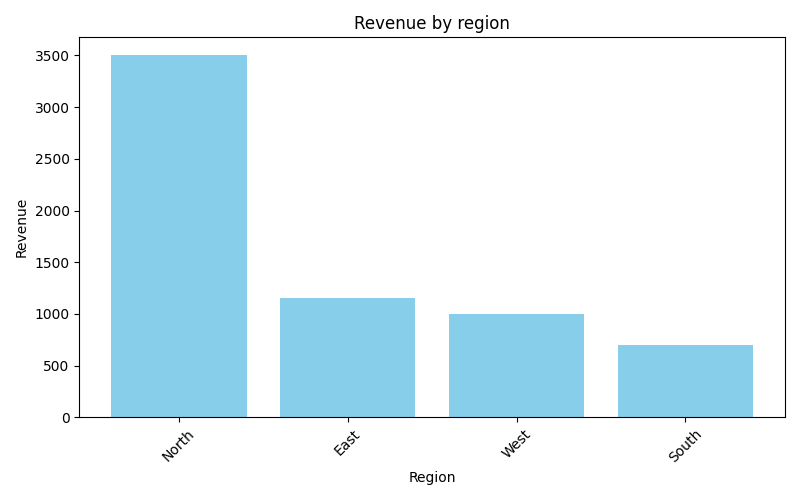
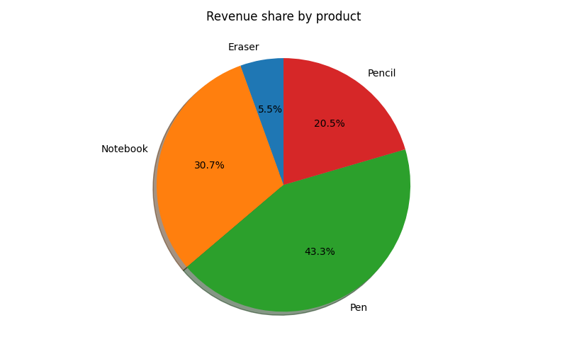
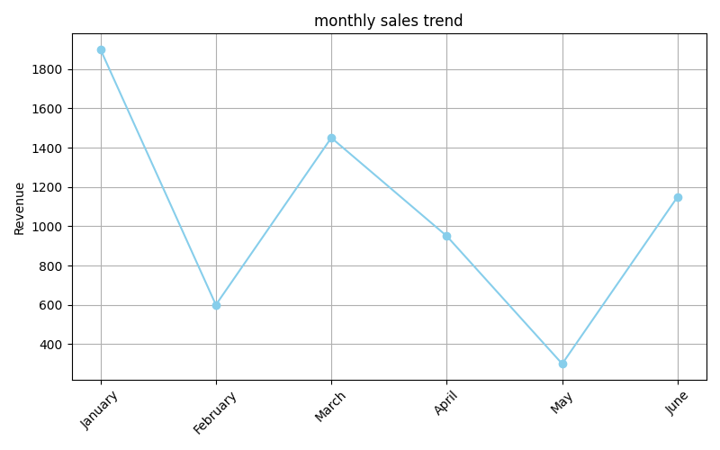

# 📊 Sales Analyzer Project

A complete **sales data analysis & visualization** project using Python, Pandas, and Matplotlib.  
Get business insights from raw CSV data with interactive charts.

---

## 📁 Project Files

| File | Description |
|------|-------------|
| `sales_data.csv` | Sample cleaned sales data |
| `sales_analysis.py` | Python script with data analysis & visualizations |
| `region_revenue.png` | Bar chart - revenue by region |
| `product_pie.png` | Pie chart - product share |
| `monthly_trend.png` | Line chart - monthly revenue trend |
| `heatmap.png` | Heatmap - region vs product |

---

## 🔍 Insights

- ✅ North region has the highest total revenue
- ✅ Pen is the most sold product
- ✅ March shows peak revenue
- ✅ Clear sales drop in Q2 (can be optimized)

---

## 📈 Charts Preview

<p float="left">
  
  
  
</p>

---

## 🛠 Tools & Tech

- Python
- Pandas
- Matplotlib
- Seaborn
- Jupyter Notebook (optional)

---

## 🚀 Run Instructions

```bash
# 1. Clone the repo
git clone https://github.com/Dhawal1441/sales-analyzer-project.git

# 2. Install requirements (if any)
pip install pandas matplotlib seaborn

# 3. Run the script
python sales_analysis.py

# 2. Install requirements (if any)
pip install pandas matplotlib seaborn

# 3. Run the script
python sales_analysis.py
